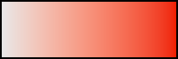
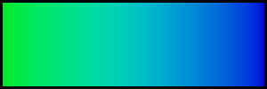
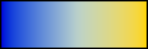

# CAM18sl
Testing CAM18sl model from this document: https://opg.optica.org/oe/fulltext.cfm?uri=oe-29-18-29257

The document has no mention of hue. However the model appears to have good hue linearity, maybe even better than Jz.

I have implemented CAM18sl in C and Python in this repo.

# Comparisons with other models

| CAM18sl | JzAzBz | LinearLight | CIELAB |
| :--: | :--: | :--: | :--: |
|  |  |  |  |
|  |  |  |  |
|  |  |  |  |
|  |  |  |  |
|  |  |  |  |
|  |  |  |  |
|  |  |  |  |

# Compiling:

To compile:
```
gcc -c gradient.c main.c cam18sl.c matrix/matrix.c; gcc -lm -o cam18sl cam18sl.o matrix.o test.o; gcc -lm -o gradient cam18sl.o matrix.o gradient.o; rm *.o;
```

To run the test program:
```
./cam18sl
```

To run the gradient generator program:
```
./gradient
```
