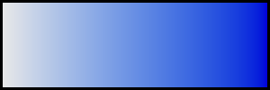
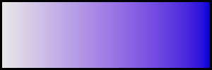
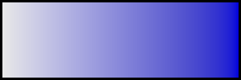
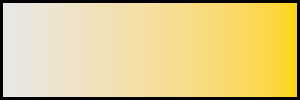
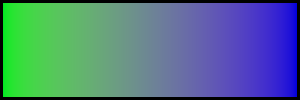
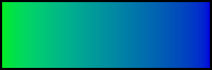
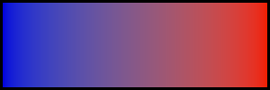
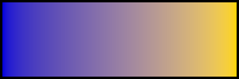

# CAM18sl
Testing CAM18sl model from this document: https://opg.optica.org/oe/fulltext.cfm?uri=oe-29-18-29257

The document has no mention of hue. However the model appears to have good hue linearity, maybe even better than Jz.

I have implemented CAM18sl in C and Python in this repo.

# Some thoughts

I must add: I don't recommend CAM18sl's brightness model for image use. I tried and quickly gave up. It massively overestimates the magnitude of HKE, and places yellow at a ridiculously high value, far above white. It just does not work, and was not designed for imagery.

However CAM18sl's Michaelis-Menten cone compression remains a unique feature (as far as I can tell), due to the semi saturation point being much lower than in, for example, CIECAM02/16, therefore having a much greater influence on Abney and Bezold-Brücke prediction. I discovered this while attempting to 'port' CIECAM02's brightness adaptation model to drive CAM18sl's semi-saturation point, and realising just how much the values differed in both models and subsequently giving up. I am not convinced of the correctness, but I find it to be a nice explanation of the Bezold-Brücke shift.

This very strong compression leads to a maximum possible brightness of 3.05 'brights' at full cone saturation. Where 'bright' is defined:

> The brightness Q is expressed in bright. 1 bright corresponds to the apparent brightness of a 10° spectral equal-energy self-luminous stimulus having a CIE 1964 10° luminance of 100 cd/m2 and surrounded by a dark background.

This upper limit of 3.05 appears to come from the `2L + M + 1/20S` sum used for calculating the achromatic (luminance) signal, so perhaps not worth reading in to. This feels very much like it was intenionally 'left blank', to avoid adding unverifiable magic numbers and doing fitting magic. As a result I am not convinced, I also *feel* that it's possible to experience a brightness sensation greater than *3 brights*, according to CAM18sl's own definition of *1 bright* (like, look at a lamp).

So... I think the cone compression is likely not correct in terms of where it places the semi saturation point. I suspect it's too low because of that low upper limit, and the seemingly intentional lack of scaling, which screams: "we don't claim this to be correct".

But I respect it more than CIECAM02/CAM16, where the semi saturation point is placed so high up that the cone compression does effectively nothing. Might as well be a pure power.

# Comparisons with other models

Just some rather meaningless gradients. The blue one is most interesting imo. It is neither too cyan like most hue models, nor mauve like Abney. It seems quite perfect.

| CAM18sl | JzAzBz | CIELAB | CIELUV |
| :--: | :--: | :--: | :--: |
|  |  |  |  |
|  |  |  |  |
|  |  |  |  |
|  |  |  |  |
|  |  |  |  |
|  |  |  |  |
|  |  |  |  |

# Compiling:

To compile:
```
gcc -c gradient.c inverse_test.c cam18sl.c; gcc -lm -o inverse_test cam18sl.o inverse_test.o; gcc -lm -o gradient cam18sl.o gradient.o; rm *.o;
```

To run the gradient generator program:
```
./gradient
```

To run the inverse verification program:
```
./inverse_test
```
